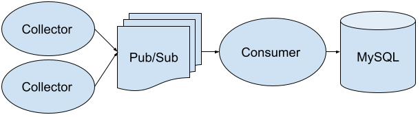

# Honey

*Get that sweet sweet honey!*

A scalable HTTP Honey Pot for Fun and Mischief.

Broken into 2 primary parts (the collector and the consumer), you can deploy Honey across VMs of any shape and any size.

## The setup is simple

* Collectors capture requests, serialize them, and toss them on to a pubsub queue.
* Consumers grab tasks, parse them, format them and insert them into a MySQL table for analysis
